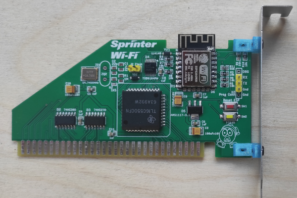

# Sprinter Wi-Fi

Проект ISA-8 платы для подключения Wi-Fi модуля ESP8266 к персональному любительскому компьютеру Sprinter.

Программное обеспечение, в настоящее время, в разработке.

[Принципиальная схема](Export/Schematic_Sprinter-ESP_v1.0.4.pdf)

[Монтажная схема](Export/PCB_Sprinter-ESP-v1.0.4.pdf)

[Спринтер в Телеграм](https://t.me/zx_sprinter)

[Спринтер в Web](https://www.sprinter.ru/)

Часто, модули с Ali идут без прошивки ESP-AT. В таком виде карта Sprinter Wi-Fi работать не будет, модуль ESP нужно прошить. Инструкция в [документе](Docs/ESP-module-flashing.pdf).

## Изменения
* _v1.0.3_ Устранена ошибка с перепутанными сигналами RTS и CTS. В [документе](Docs/rts-cts-fix.pdf) описано, как это исправить на старых версиях платы.
* _v1.0.4_ Добавлен контакт VCC на разъеме X2 для подачи напряжения 5В при программировании ESP через внешний USB-TTL UART адаптер.
* _v1.0.5_ Косметические изменения для удобства пайки.
